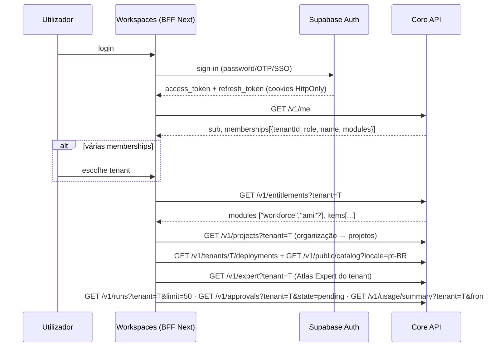

# 04 — Contrato Workspaces ↔ Core

**Fonte de verdade técnica:** [`core-workspaces-v1.draft.openapi.json`](core-workspaces-v1.draft.openapi.json), em OpenAPI 3.1 com `x-status` por operação. É válido para geração de tipos (o `openapi-typescript` 7.9.1 gera 1307 linhas sem erros (draft 2)).
**O contrato passa por GitHub, não por mensagens.** Alterações por PR neste diretório, com revisão do WORKSPACES-QA-001. O frontend (`AtlasHub-Workspaces`) e o backend são agora do mesmo responsável (Claude); o contrato continua a ser a fronteira.

## 1. Princípios acordáveis

1. **Um backend:** o Workspaces só fala com o Core. Não lê o `atlas-agent-packs`, o Supabase diretamente (exceto o Auth), o n8n nem o Hermes.
2. **Um catálogo de Workers:** os nomes, descrições e capacidades vêm de `GET /v1/public/catalog` (comercial, i18n) e de `GET /v1/roles`/`PackRelease` (técnico). O Workspaces não mantém listas próprias.
3. **O tenant é escolhido, não afirmado:** o FE envia `?tenant=` em todas as leituras de tenant e o Core reconcilia com a membership.
4. **Os módulos vêm dos entitlements:** a navegação (Workforce, AMI) obedece a `modules` de `GET /v1/entitlements`. Esconder no FE não substitui o 403 do Core.
5. **Sem dados reais em demo (G2):** ambientes de demonstração usam os tenants sintéticos A/B e os seeds.
6. **Compatibilidade:** apenas alterações **aditivas** na linha 1.x. Remover ou renomear campos exige `/v2` ou uma deprecação anunciada no contrato.

## 2. Sequência mínima do FE



## 3. Formas principais (resumo; o detalhe está no OpenAPI)

```jsonc
// GET /v1/me                                    (novo)
{ "sub": "uuid", "email": "ana@empresa.com" | null,
  "memberships": [{ "tenantId": "t1", "role": "tenant_admin", "name": "Empresa", "tenantStatus": "active", "modules": ["workforce"] }] }

// GET /v1/entitlements?tenant=t1                (novo)
{ "tenantId": "t1", "modules": ["workforce", "ami"],
  "items": [{ "key": "mission.tpl-002-standard", "source": "subscription", "quantity": 1,
              "validFrom": "…", "validUntil": "…" | null, "status": "active" }] }

// GET /v1/runs?tenant=t1&state=completed&limit=50&cursor=…   (estendido; sem cursor → array como hoje)
{ "items": [{ "id": "…", "deploymentId": "…", "state": "completed", "attempts": 1,
              "startedAt": "…", "finishedAt": "…", "costEstimate": "0" }], "nextCursor": "…" | null }

// GET /v1/usage/summary?tenant=t1&from=…&to=…  (novo)
{ "from": "…", "to": "…", "runs": { "completed": 120, "awaiting_approval": 3 },
  "metrics": [{ "metric": "calendar_mutation", "unit": "action", "quantity": 42, "estimatedCost": "0", "currency": "BRL" }] }
```

**Compatibilidade de `/v1/runs`:** sem `cursor` nem `limit`, a resposta continua a ser o **array** atual, para não partir o App.AtlasHub.Si. Com `limit` ou `cursor`, devolve `{items, nextCursor}`.

## 4. Erros

O formato é único, vindo do filtro global: `{ "statusCode": 403, "error": "Select a tenant" }`. Os 5xx devolvem sempre `"dependency_or_server_error"`, sem detalhe interno.

| Código | Significado para o FE |
|---|---|
| 401 | Sessão inválida ou expirada → refresh, senão login |
| 403 `Select a tenant` | Várias memberships e falta `?tenant=` |
| 403 | Papel insuficiente, sem membership, ou módulo/entitlement em falta |
| 404 | Recurso fora do tenant (indistinguível de inexistente, por desenho) |
| 429 | Limite de mutações (120 POST/min por origem) |
| 503 | Dependência indisponível (`/ready` falha) |

## 5. Decisões de implementação (Claude, FE + BE)

- [x] **BFF no servidor Next**: o token fica em cookie HttpOnly e o Core não precisa de CORS.
- [ ] Locale por defeito do Workspaces (`pt-BR` no Core) e decisão PT-PT/PT-BR.
- [ ] O que mostrar para tenants com `tenantStatus ≠ active`.
- [ ] Paginação: `limit` máximo de 100 e cursor opaco são suficientes para a primeira versão?
- [x] Tipos: o Workspaces usa tipos alinhados com o rascunho e passa a gerá-los do `openapi.json` publicado quando os PRs D/E entrarem.
- [x] Hierarquia **organização → projetos** (ver [08](08-PLANO-CLIENTES-PROJETOS-EXPERT.md)); `GET /v1/projects*` chega com a migration 007.
